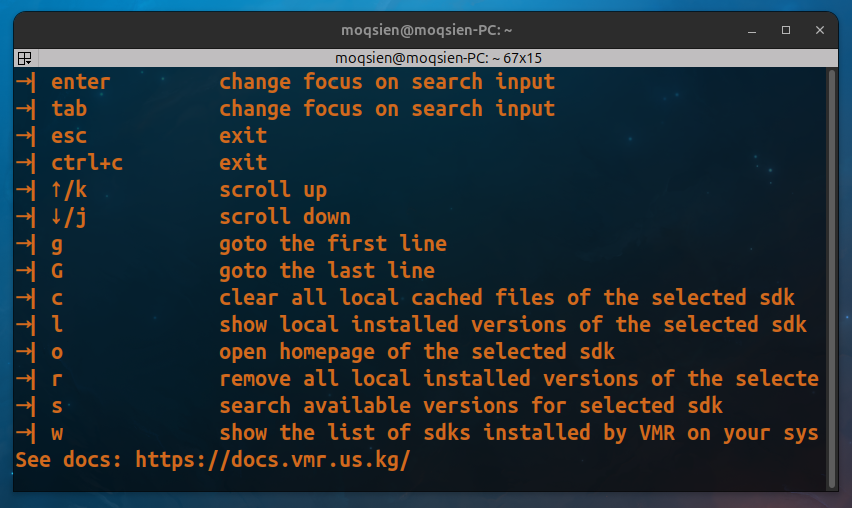

import { Tabs, TabItem } from '@astrojs/starlight/components';

## Where are the envs restored for MacOS/Linux?

<Tabs>
  <TabItem label="Others" icon="seti:shell">
    ```bash
    $HOME/.vmr/vmr.sh
    ```
  </TabItem>
  <TabItem label="Fish" icon="seti:shell">
    ```bash
    $HOME/.vmr/vmr.fish
    ```
  </TabItem>
</Tabs>

## Need to refresh the envs for current terminal session?

VMR customizes a **"source"** command for powershell on windows. You can use it to refresh the $PATH env.
See it in file listed below.
```text
$HOME\Documents\WindowsPowerShell\profile.ps1
```

## Why some of the SDKs on Windows can not run properly？

For example, agg, php, etc. It may be caused by lacking of Microsoft Visual C++ Redistributable. You can download it from [here](https://learn.microsoft.com/en-us/cpp/windows/latest-supported-vc-redist?view=msvc-170).

## Is it safe to use VMR?

Of course. All the SDKs are downloaded from the **official websites**, or **github releases**, or **Anaconda Forge**. VMR at now is not planning to provide anything like compilation from source code since stability issues cannot be avoided. You can also check the version info [here](https://github.com/gvcgo/vsources).

## No list shown?


Just resize your terminal window!
