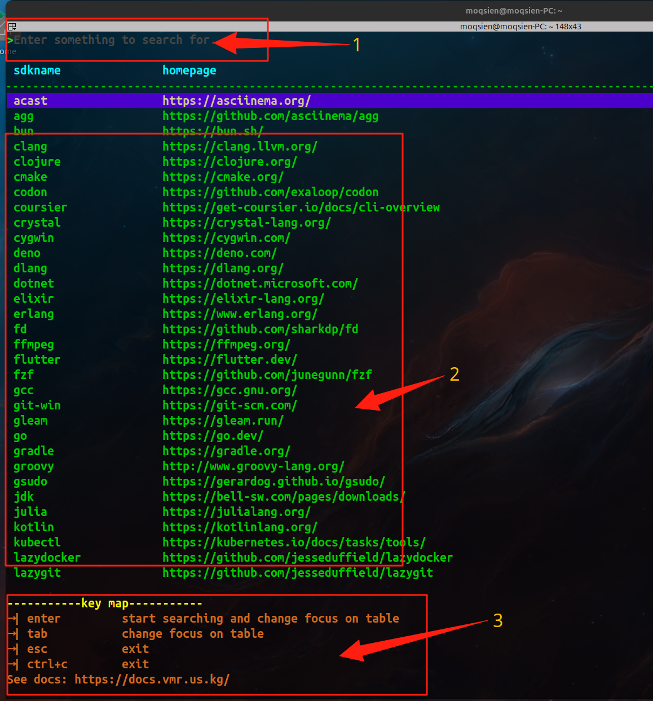
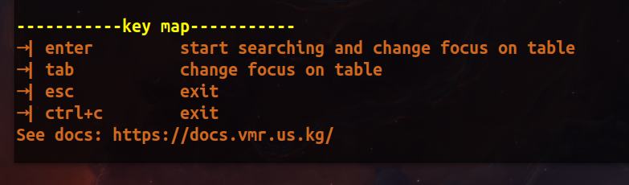
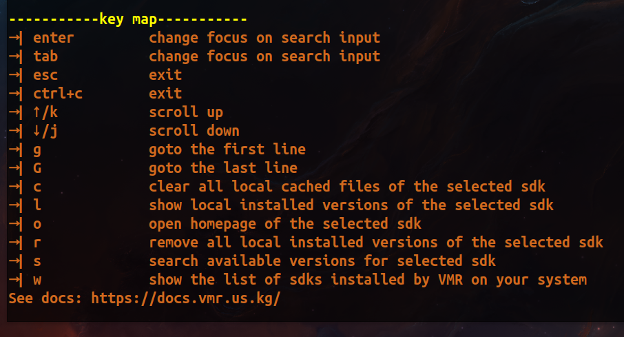
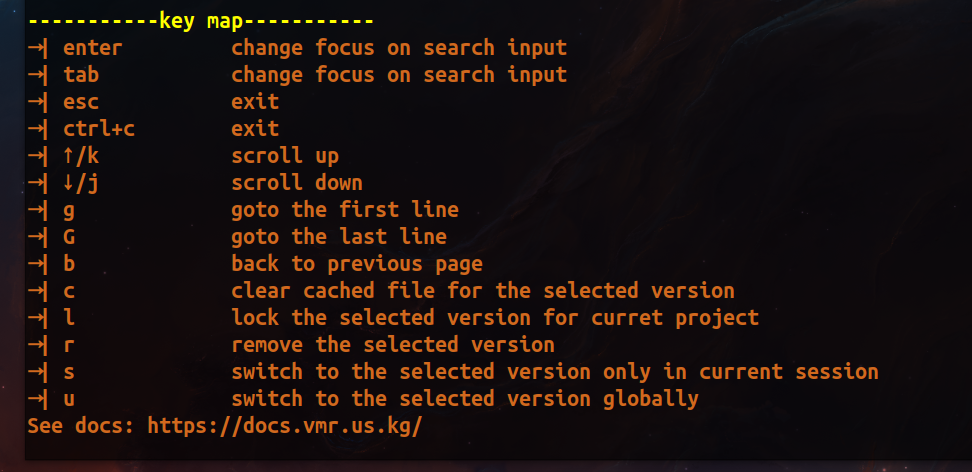

import {Aside } from '@astrojs/starlight/components';

## Set Proxy

<Aside type="caution" title="Note">
  Proxy is highly recommended if github.com reponds slowly.
</Aside>

```bash
vmr sp "http(socks5)://127.0.0.1:xxxx"
```

## Set Reverse Proxy

<Aside type="caution" title="Note">
  Choose **either** reverse proxy **or** proxy.
</Aside>

```bash
vmr sr "https://proxy.vmr.us.kg/proxy/"
```

## Start TUI

```bash
vmr
```

## Explanations for TUI


- **1->** Search box (Just search by prefix).
- **2->** Message List (Including SDK List and Version List).
- **3->** Hints for key map.

## Key Map Hints for Search-box


- Press **"enter"** to start searching.
- Press **"tab"** to swith focus between list and search box.
- Press **"esc"** to exit.
- Press **"ctrl+c"** to exit.
- And more...

## Key Map Hints for SDK-list


- Press **"l"** to show local installed versions for the selected SDK.
- Press **"o"** to open the homepage of the selected SDK with browser.
- Press **"c"** to delete the cached files for the selected SDK.
- Press **"r"** to uninstall all the versions installed for the selected SDK.
- Press **"s"** to show all available versions for the selected SDK.
- Press **"w"** to show which sdks are installed for current system.
- And more...

## Key Map Hints for Available-version-list


- Press **"i"** to install the selected version.
- Press **"l"** to lock the selected version for current project.
- Press **"s"** to use/install the selected version **in current session only**.
- Press **"b"** to go back to SDK-list.
- And more...

## Key Map Hints for Installed-version-list


- Press **"c"** to clear cached files for the selected version.
- Press **"r"** to uninstall the selected version.
- Press **"l"** to lock the selected version for current project.
- Press **"u"** to use/swith to the selected version.
- Press **"s"** to swith to the selected version **in current session only**.
- Press **"b"** to go back to SDK-list.
- And more...

## SDK List not found?

<Aside type="caution" title="Note">
  If VMR shows **No SDK Found**, you probably need to set a [proxy](/guides/tutorial/#set-proxy) for VMR.
</Aside>

## How to enable multi-thread download?

Set number of threads > 1.
```bash
vmr st 2
```

## How to toggle customed mirrors?

```bash
# $HOME/.vmr/customed_mirrors.toml
vmr tm
```
The default customed mirrors is available [here](https://github.com/gvcgo/vsources/blob/main/mirrors/customed_mirrors.toml).
