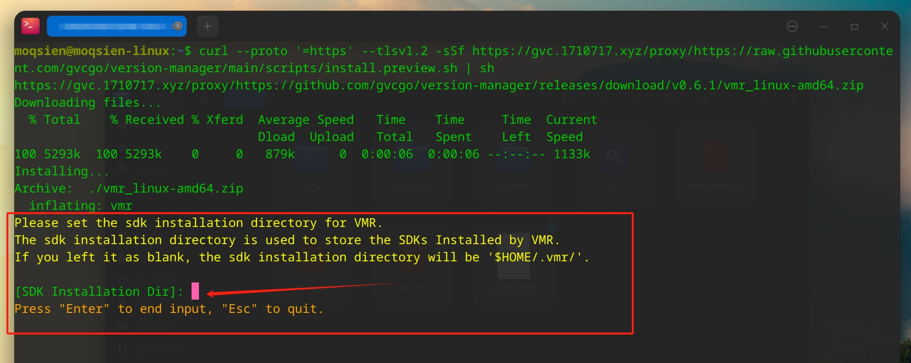

import { Tabs, TabItem, Aside } from '@astrojs/starlight/components';

## Installation

<Tabs>
  <TabItem label="Windows" icon="seti:windows">
    ```bash
    powershell -c "irm https://scripts.vmr.us.kg/windows | iex"
    ```
  </TabItem>
  <TabItem label="MacOS" icon="apple">
    ```bash
    curl --proto '=https' --tlsv1.2 -sSf https://scripts.vmr.us.kg | sh
    ```
  </TabItem>
  <TabItem label="Linux" icon="linux">
    ```bash
    curl --proto '=https' --tlsv1.2 -sSf https://scripts.vmr.us.kg | sh
    ```
  </TabItem>
</Tabs>

<Aside type="caution" title="Note">
  Binaries built from go source code shows **Virus False Positive** somehow on [Windows](https://go.dev/doc/faq#virus). VMR is signed by osslsigncode to avoid this annoying situation. However, we cannot ensure that it will never happen. In case of False Positive, you can manually add the VMR directory to your Trusted directory, or try to install the [certificate](https://github.com/gvcgo/version-manager/blob/main/scripts/vmr.pfx).
</Aside>

## Can I customize the Installation Dir for SDKs?

Yes, of course. A hint will prompt to ask for customizing your SDK Installation Dir during the installation of VMR for the first time on your system. 


And you can also edit the config file for VMR manually.
```bash
$HOME/.vmr/config.toml
```

## Where is VMR installed?

```bash
$HOME/.vmr/
```

## Post Installation

If an [error](https://stackoverflow.com/questions/41117421/ps1-cannot-be-loaded-because-running-scripts-is-disabled-on-this-system) like **"ps1 cannot be loaded because running scripts is disabled on this system"** occurrs in **Powershell**, try the following command.
```bash
Set-ExecutionPolicy -ExecutionPolicy Bypass -Scope CurrentUser
```

## Update

```bash
vmr-update
```

## Uninstall

```bash
vmr-uninstall
```

## Learn More

- [concepts](/starts/concepts/)
- [documents](/guides/tutorial/)
- [faqs](/guides/faq/)
