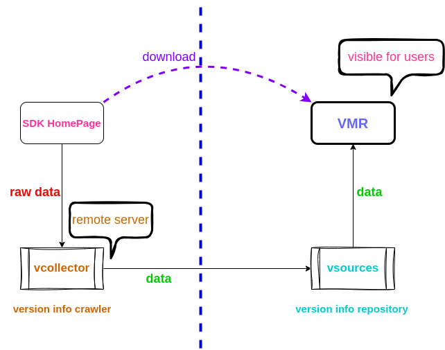

## 数据流转过程

- [vcollector](https://github.com/gvcgo/vcollector) 收集版本信息并上传至版本仓库.
- [vsources](https://github.com/gvcgo/vsources) 版本仓库.
- [vmr](https://github.com/gvcgo/version-manager) 用户界面.

vcollector是部署在服务器上的，定时完成收集工作，用户无需关心。对于有能力的开发者，可以向Vcolletor贡献代码，增加支持的SDK。 另外，SDK的更新频率一般比较低，
所以Vcolletor的收集频率是够用的。
