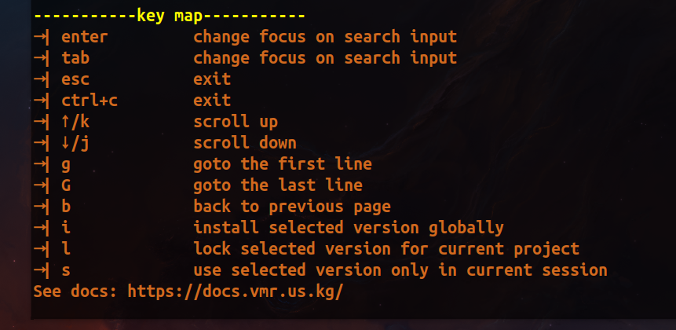

import {Aside } from '@astrojs/starlight/components';

## 设置代理

<Aside type="caution" title="Note">
  强烈推荐使用自己的代理，如果你访问github速度过慢。
</Aside>

```bash
vmr sp "http(socks5)://127.0.0.1:xxxx"
```

## 设置反向代理

<Aside type="caution" title="Note">
  代理和反向代理，选其一即可。但推荐使用自己的代理，因为比较稳定。
</Aside>

```bash
vmr sr "https://proxy.vmr.us.kg/proxy/"
```

## 开启TUI

```bash
vmr
```

## 关于TUI界面的解释


- **1->** 搜索框区域 (仅支持前缀搜索).
- **2->** 列表展示区域 (包括SDK列表和版本列表).
- **3->** 当前区域的快捷按键提示.

## 搜索框相关快捷按键提示


- 按下 **"enter"** 开始搜素，并切换焦点到列表上.
- 按下 **"tab"**  切换焦点.
- 按下 **"esc"** 退出.
- 按下 **"ctrl+c"** 退出.

## SDK列表相关快捷按键提示


- 按下 **"l"** 展示关于已选中的SDK的本地已安装了哪些版本.
- 按下 **"o"** 打开已选中的SDK的官方主页.
- 按下 **"c"** 删除已选中的SDK的所有本地缓存文件.
- 按下 **"r"** 卸载已选中的SDK的所有本地已安装版本.
- 按下 **"s"** 展示已选中的SDK的所用可安装的版本.
- 按下 **"w"** 展示本机上通过VMR安装了哪些SDK.
- 更多...

## 可安装版本列表相关的快捷按键提示


- 按下 **"i"** 全局模式安装选中版本.
- 按下 **"l"** 为当前项目锁定已选中的版本.
- 按下 **"s"** 会话模式(session-only)使用选中版本(如果未安装，则会以会话模式安装，注意，不会持久化环境变量).
- 按下 **"b"** 回到SDK列表.
- 更多...

## 已安装版本列表相关的快捷按键提示


- 按下 **"c"** 清空已选中版本的本地缓存文件.
- 按下 **"r"** 卸载选中的版本.
- 按下 **"l"** 为当前项目锁定已选中的版本.
- 按下 **"u"** 以全局模式切换到选中的版本.
- 按下 **"s"** 以会话模式切换到选中的版本.
- 按下 **"b"** 回到SDK列表.
- 更多...

## SDK列表没找到?

<Aside type="caution" title="Note">
  如果VMR出现**No SDK Found**错误提示, 大概率是你需要设置[代理](/zh-cn/guides/tutorial/#设置代理).
</Aside>

## 如何开启多线程下载模式?

把默认的下载线程数设置为大于1的值即可.参考下面的命令.注意，可能有些下载源不支持多线程下载，会导致下载失败，这种情况下把线程数设置回1即可。
```bash
vmr st 2
```

## 如何开启/关闭定制下载源?
如下命令(以及相关配置文件)。有默认的配置，可以自行根据需要编辑。
```bash
# $HOME/.vmr/customed_mirrors.toml
vmr tm
```
默认的定制源配置在[这里](https://github.com/gvcgo/vsources/blob/main/mirrors/customed_mirrors.toml).

## 如果你还是觉得VMR展示列表的响应慢，怎么办？

可以在VMR的配置文件中，设置如下字段。
```bash
VersionHostUrl='https://gitee.com/moqsien/vsources/raw/main'
```
这是VMR版本仓库的国内镜像仓库。
