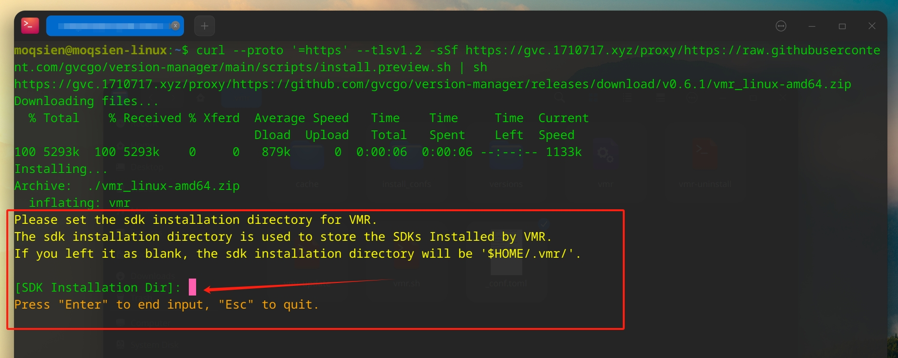

import { Tabs, TabItem, Aside } from "@astrojs/starlight/components";

## 安装

<Tabs>
  <TabItem label="Windows" icon="seti:windows">
    ```bash powershell -c "irm https://scripts.vmr.us.kg/windows | iex" ```
  </TabItem>
  <TabItem label="MacOS" icon="apple">
    ```bash curl --proto '=https' --tlsv1.2 -sSf https://scripts.vmr.us.kg | sh
    ```
  </TabItem>
  <TabItem label="Linux" icon="linux">
    ```bash curl --proto '=https' --tlsv1.2 -sSf https://scripts.vmr.us.kg | sh
    ```
  </TabItem>
</Tabs>

<Aside type="caution" title="Note">
  对于Windows，go项目编译得到的exe容易[误报病毒](https://go.dev/doc/faq#virus).
  因此，VMR使用osslsigncode进行了自签名. 但不能保证误报不会发生. 如果出现误报,
  你可以把和VMR有关的一些文件夹都添加到信任列表,
  或者尝试手动安装一下VMR的[签名证书](https://github.com/gvcgo/version-manager/blob/main/scripts/vmr.pfx).
</Aside>

## 安装速度太慢，怎么办？

在你的终端使用代理。

<Tabs>
  <TabItem label="Windows" icon="seti:windows">
    ```bash $env:all_proxy="http://127.0.0.1:xxxx" #
    $env:all_proxy="socks5://127.0.0.1:xxxx" ```
  </TabItem>
  <TabItem label="MacOS" icon="apple">
    ```bash export ALL_PROXY="http://127.0.0.1:xxxx" # export
    ALL_PROXY="socks5://127.0.0.1:xxxx" ```
  </TabItem>
  <TabItem label="Linux" icon="linux">
    ```bash export ALL_PROXY="http://127.0.0.1:xxxx" # export
    ALL_PROXY="socks5://127.0.0.1:xxxx" ```
  </TabItem>
</Tabs>

## 我能定制 SDK 的安装路径吗?

可以. 在首次安装 VMR 的过程中，会有提示，输入自己想要指定的目录即可.


另外，你也可以到 VMR 的配置文件中手动编辑.

```bash
$HOME/.vmr/config.toml
```

## VMR 安装到哪儿了?

```bash
$HOME/.vmr/

# Windows
# %HOMEPATH%\.vmr\
```

## 安装之后的一些处理

在 Windows 下，如果出现类似**"ps1 cannot be loaded because running scripts is disabled on this system"**的错误，那么可以尝试执行下面的命令。

```bash
Set-ExecutionPolicy -ExecutionPolicy Bypass -Scope CurrentUser
```

## 更新

```bash
vmr-update
```

## 卸载

```bash
vmr-uninstall
```

## 学习更多 VMR 使用技巧

- [核心概念](/zh-cn/starts/concepts/)
- [文档](/zh-cn/guides/tutorial/)
- [常见问题](/zh-cn/guides/faq/)
